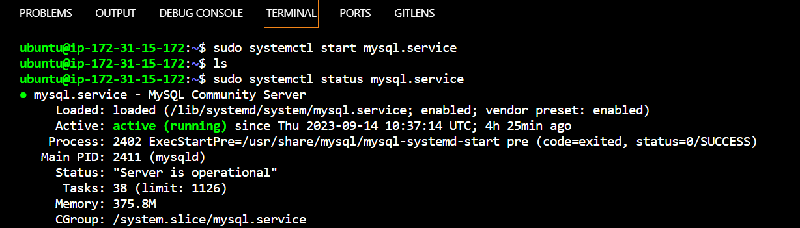

CLIENT-SERVER ARCHITECTURE WITH MYSQL
***

mysql-client installed on mysql client linux server
```
sudo apt install mysql-client

```

***
Using mysql server's local (private) IP address to connect from mysql client. Recall; MySQL server uses TCP port 3306 by default, so you will have to open it by creating a new entry in ‘Inbound rules’ in ‘mysql server’ Security Groups.

mysqlserver server installed on mysqlserver instance


```
sudo apt install mysql-server
```
***
Ensure that the server is running using the systemctl command:

```
sudo systemctl start mysql.service
sudo systemctl status mysql.service
```


***

MySQL server configured to allow connections from remote hosts.
```
sudo vi /etc/mysql/mysql.conf.d/mysqld.cnf
```


